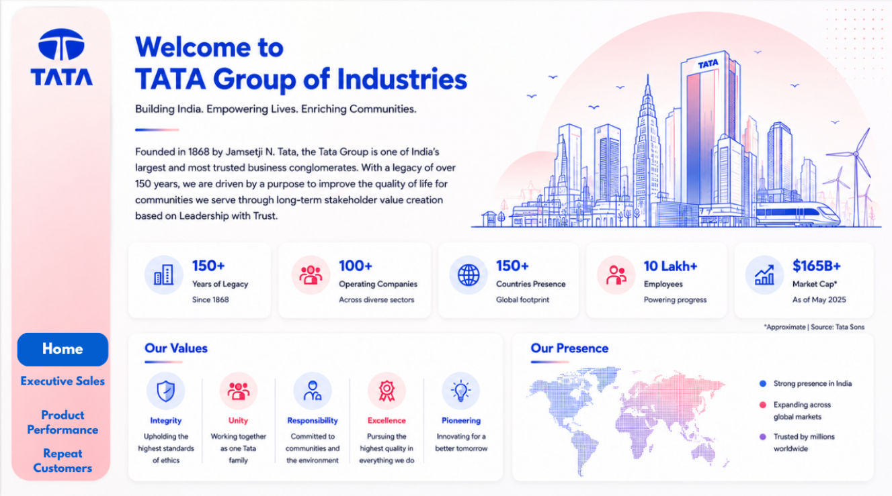
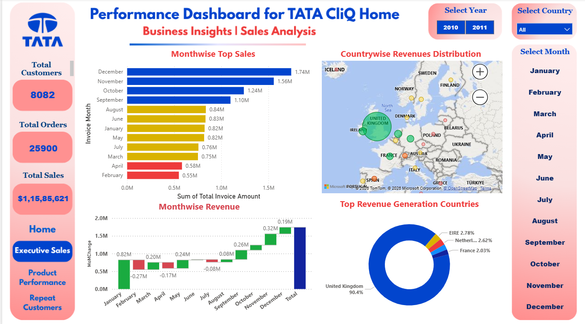
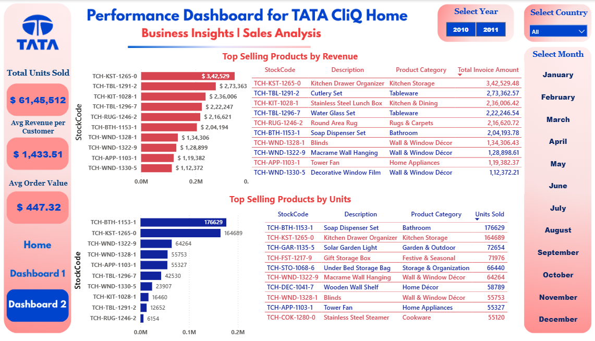
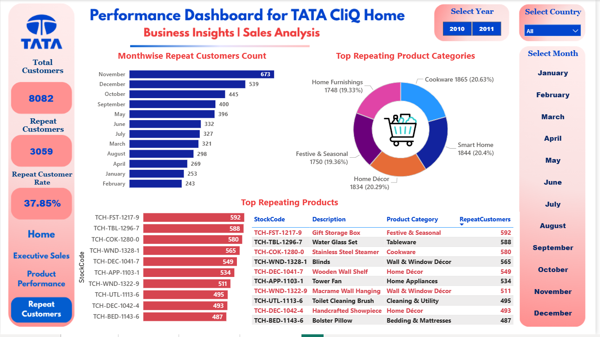

# 🏠 TATA CLiQ Home — E-Commerce Business Intelligence Dashboard

Interactive Power BI e-commerce analytics dashboard analyzing 541,909 transaction records across 8,082 customers, 375 products, and multiple countries to generate actionable sales, retention, and product performance insights.

 

> **Disclaimer:** This is an independent portfolio/business intelligence case study built on a public online-retail dataset. It is **not** an official internal report of Tata CLiQ or the Tata Group; branding is used solely for presentation purposes.


## 📑 Table of Contents

- [📊 Project Overview](#-project-overview)
- [🎯 Business Problem](#-business-problem)
- [🎯 Project Objectives](#-project-objectives)
- [📁 Dataset](#-dataset)
  - [Dataset Columns](#dataset-columns)
  - [Geographic Coverage](#geographic-coverage)
  - [Product Categories](#product-categories)
- [📈 Key Dataset KPIs](#-key-dataset-kpis)
- [📊 Dashboard Design](#-dashboard-design)
  - [🏠 Home Page](#1--home-page)
  - [📈 Dashboard 1 — Sales & Geographic Analysis](#2--dashboard-1--sales--geographic-analysis)
  - [🛒 Dashboard 2 — Product Performance](#3--dashboard-2--product-performance)
  - [👥 Dashboard 3 — Customer & Retention Analysis](#4--dashboard-3--customer--retention-analysis)
- [🛠️ Tools Used](#-tools-used)
- [🚀 Business Value](#-business-value)
- [🔄 Project Workflow](#-project-workflow)
- [📂 Repository Structure](#-repository-structure)
- [👨‍💻 Author](#-author)

---

## 📊 Project Overview

This project presents an interactive **TATA CLiQ Home E-Commerce Business Intelligence Dashboard** developed to analyze sales performance, customer retention, product performance, and geographic revenue distribution for an online home-retail business.

The project transforms a raw e-commerce transaction dataset containing **541,909 transaction lines** into an interactive business intelligence solution designed to help management understand revenue drivers, seasonal demand patterns, top-performing products, and customer loyalty behavior.

The dashboard provides both a **high-level executive view** and detailed drill-down analysis using interactive filters for:

* Year
* Country
* Month

The project combines **data cleaning, KPI development, segmentation, visualization, and business storytelling** to demonstrate an end-to-end data analytics workflow.

> **Disclaimer:** This is an independent portfolio/business intelligence case study built on a public online-retail dataset. It is **not** an official internal report of Tata CLiQ or the Tata Group; branding is used solely for presentation purposes.

---

## 🎯 Business Problem

E-commerce businesses generate large volumes of transaction data. Without an analytical dashboard, management may find it difficult to quickly answer questions such as:

* How many customers and orders does the business have?
* What is the total revenue, and how is it trending month over month?
* Which months and seasons generate the most revenue?
* Which countries contribute the most revenue?
* Which products and categories are the top performers — by revenue and by units sold?
* How many customers are repeat buyers, and how much revenue do they generate?
* Which product categories drive the most repeat purchases?
* Where should the business focus retention, inventory, and expansion efforts?

This project addresses these questions through an interactive Power BI dashboard.

---

## 🎯 Project Objectives

The main objectives of the project were to:

1. Analyze overall sales performance (customers, orders, revenue).
2. Identify monthly and seasonal revenue trends.
3. Analyze revenue distribution by country.
4. Identify top-performing products by revenue and by units sold.
5. Calculate the repeat customer rate and its revenue contribution.
6. Analyze monthwise repeat customer behavior.
7. Identify top repeating product categories and products.
8. Build interactive KPIs and visualizations.
9. Enable dynamic filtering by year, country, and month.
10. Convert raw transaction data into actionable business insights.

---

# 📁 Dataset

The dataset contains:

**541,909 transaction records**

covering order details, customer identifiers, product/SKU information, invoice dates, and country of purchase.

### Dataset Columns

| Column | Description |
|---|---|
| Invoice No. | Unique order/invoice identifier |
| StockCode | Unique product/SKU code |
| Description | Product name |
| Product Category | Product category classification |
| Quantity | Units purchased |
| Invoice Date | Date and time of transaction |
| Unit Price | Price per unit |
| Customer ID | Unique customer identifier |
| Country | Customer's country |
| Total Invoice Amount | Engineered field (Quantity × Unit Price) |

### Geographic Coverage

The dataset spans multiple countries, led by:

* United Kingdom
* EIRE
* Netherlands
* Germany
* France
* Other European & international markets

### Product Categories

Products span categories including:

* Kitchen Storage
* Tableware
* Kitchen & Dining
* Bathroom
* Rugs & Carpets
* Wall & Window Décor
* Home Appliances
* Cookware
* Smart Home
* Home Décor
* Festive & Seasonal
* Home Furnishings
* Cleaning & Utility
* Bedding & Mattresses
* Storage & Organization
* Garden & Outdoor

---

# 📈 Key Dataset KPIs

Based directly on the uploaded dataset:

| KPI | Result |
|---|---:|
| Total Customers | 8,082 |
| Total Orders | 25,900 |
| Total Sales | ₹11,585,621.15 (~₹11.59M) |
| Average Order Value | ₹447.32 |
| Average Revenue per Customer | ₹1,433.51 |
| Repeat Customers | 3,059 |
| Repeat Customer Rate | 37.85% |
| Repeat Customer Revenue Share | 78.27% |
| Product/SKU Codes | 375 |

The gap between repeat customer rate (37.85%) and repeat customer revenue share (78.27%) highlights that a relatively small group of loyal customers drives the majority of the business.

---

# 📊 Dashboard Design

The Power BI dashboard contains four pages.

## 1. 🏠 Home Page



The landing page introduces TATA Group / TATA CLiQ Home branding and provides navigation to:

* Executive Sales
* Product Performance
* Repeat Customers

The homepage is designed as an executive entry point to the analytics solution.

---

## 2. 📈 Dashboard 1 — Sales & Geographic Analysis



### KPI Cards

* Total Customers
* Total Orders
* Total Sales

### Visualizations

* Monthwise Top Sales (bar chart)
* Monthwise Revenue Trend (waterfall / MoM change)
* Countrywise Revenue Distribution (map)
* Top Revenue Generation Countries (donut chart)

This page gives management a complete overview of sales performance and seasonality.

---

## 3. 🛒 Dashboard 2 — Product Performance



### KPI Cards

* Total Units Sold
* Average Revenue per Customer
* Average Order Value

### Visualizations

* Top Selling Products by Revenue (with SKU-level detail table)
* Top Selling Products by Units Sold (with SKU-level detail table)

This page is particularly useful for assortment planning and inventory decisions.

---

## 4. 👥 Dashboard 3 — Customer & Retention Analysis



### KPI Cards

* Total Customers
* Repeat Customers
* Repeat Customer Rate

### Visualizations

* Monthwise Repeat Customers Count
* Top Repeating Product Categories (donut chart)
* Top Repeating Products (SKU-level detail table)

This page effectively communicates customer loyalty and retention behavior.

---

# 🛠️ Tools Used

### Power BI

Used for:

* Dashboard development
* KPI cards
* Interactive slicers
* Map & geographic visualization
* Waterfall / trend visualization
* Product and customer segmentation
* Business intelligence reporting

### Microsoft Excel

Used for:

* Source data storage (Raw Data / Cleaned Data)
* Data cleaning and transformation
* Engineered field creation (Invoice Year, Invoice Month, Total Invoice Amount)

### Data Analysis Concepts

The project demonstrates:

* Exploratory Data Analysis
* Data Cleaning & Transformation
* KPI Development
* Customer Retention Analysis
* Seasonal Trend Analysis
* Geographic Revenue Analysis
* Product Performance Analysis
* Business Intelligence
* Data Visualization
* Business Storytelling

---
## 🚀 Business Value

This dashboard equips Tata CLiQ's business and category teams with the insights needed to make faster, data-driven decisions:

- **Improve sales performance** by identifying top-performing categories, brands, and products
- **Optimize inventory planning** through demand and stock-turnover trend visibility
- **Enhance customer experience** by tracking delivery timelines, return rates, and satisfaction trends
- **Increase marketing ROI** by analyzing campaign performance and conversion trends across channels
- **Strengthen pricing strategy** with visibility into discounting patterns and margin impact
- **Reduce cart abandonment** by identifying friction points in the customer purchase journey
---

# 🔄 Project Workflow

```text
Raw E-Commerce Transaction Dataset
        ↓
Data Cleaning & Profiling
        ↓
Data Quality Validation
        ↓
Feature Engineering (Invoice Year, Month, Total Invoice Amount)
        ↓
Customer & Product Segmentation
        ↓
KPI Development
        ↓
Power BI Dashboard (4 Pages)
        ↓
Interactive Drill-Down
        ↓
Business Insights
        ↓
Strategic Recommendations
```

---

# 📂 Repository Structure

```text
Project12-TATA-CLIQ-Ecommerce-Analysis/
│
├── dataset/
│   └── Online_Retail.xlsx
│
├── TATA Sales Dashboard.pbix
│
├── images/
│   ├── Dashboard1.png
│   ├── Dashboard2.png
│   ├── Dashboard3.png
│   └── Dashboard4.png
│
├── Report/
│   ├── TATA CLiQ Analysis Report.pdf
│   └── TATA CLiQ Analysis Report.docx
│
└── README.md
```

---

# 👨‍💻 Author

**Rishav Kumar Mishra**

Aspiring Data Analyst

📧 Email: iamkmr1999@gmail.com

🔗 GitHub: https://github.com/iamkmr19

💼 LinkedIn: https://www.linkedin.com/in/kmrishav19/

---

⭐ If you found this project useful, consider giving this repository a Star!
